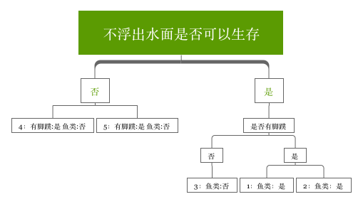

# 第三章 决策树
决策树的数据必须是枚举类型的。或者说是整数。

## 信息增益和熵
符号xi的信息定义为:
```
	l(xi) = -logp(xi)
```
熵的定义:
```
H = -Σ(p(xi)logp(xi))
```
熵的这种表示形式和逻辑回归很像。

对于数据集中标签的熵的计算方法，是：
```
1 计算概率p
	1.1 p = label的数量/总的数据集的数量
2 计算熵
	2.1 将所有的 -p*log(p) 相加求和
```

熵越高，表示混合的数据越多，可以在数据集中增加更多的分类，以便观察熵的变化。

## 分类
有了熵的定义，我们就知道所谓的分类就是使得熵不断的下降收敛，就是最好的分类。（因为熵越高，表示混合的数据越多;熵越低，表示逐渐在进行分类)

如何进行分类？所谓的分类就是将其中一个指定的特征量抽取出来，余下的组成数据集。例如:
[[1, 0, 0],
 [1, 0, 2]
 [0, 1, 1]]
按照第一列抽取,就是[1, 1, 0]和剩下的[[0,0], [0, 2], [1, 1]]， 指定特征量为0，那么结果就是[[0, 0], [0, 2]].按照第二列抽取，就是 [[1,0], [1, 2], [0, 1]] 指定特征量如果为1，就是[[1, 0], [1, 2]]

## 决策树的构建
在构建决策树中，看每层是否是相同的分类，如果是相同的分类，则不能继续划分，也就是叶子节点；如果不是相同的分类，可以继续划分。
看下里面的例子.

| 序号| 不浮出水面是否可以生存 | 是否有脚蹼 | 是否属于鱼类 |
|----|-------------------|-----------|------------|
| 1 | 是 | 是 | 是 |
| 2 | 是 | 是 | 是 |
| 3 | 是 | 否 | 否 |
| 4 | 否 | 是 | 否 |
| 5 | 否 | 是 | 否 |

决策树的结果:



4，5组成的分类就是一个叶子节点，因为4和5的 列别都是一样的。

