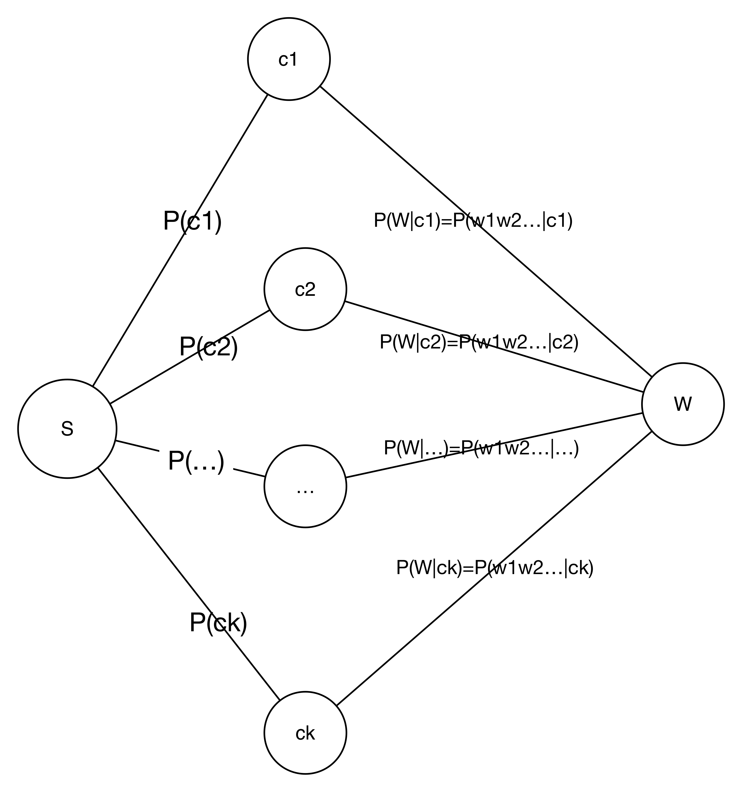
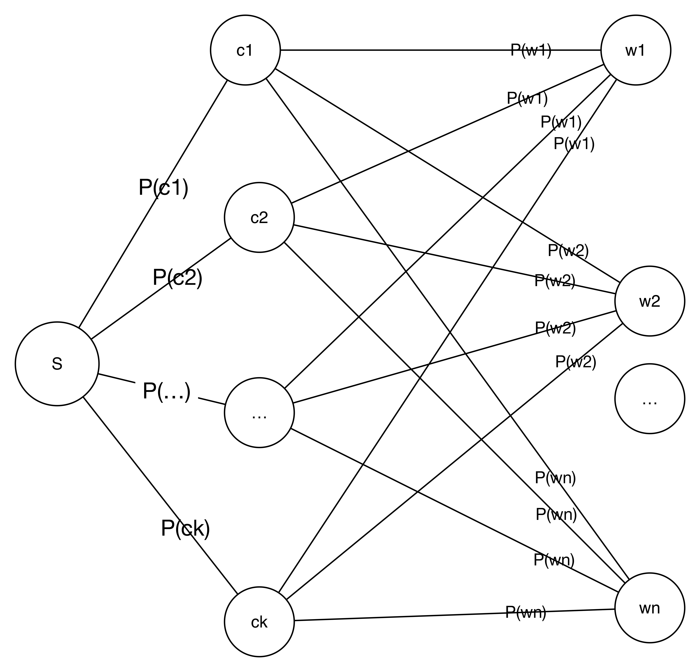

# 第四章 朴素贝叶斯分类

## 贝叶斯分类的标准解答
wi={第i个特征值出现的事件}, 对于给定的一个样本W={wk个特征出现}，其中wk={从w1,w2,...,wn中取出k个特征}。这里又告诉我们一点，关于事件的定义，就是元素出现的集合。所以对于W的分类预测是:max(P(ci|W)),其中i∈[1,size(c)]. 也就是求W发生的情况的，每个分类出现的概率的最大值。那么这个分类就是W所对应的分类。现在计算这个条件概率,使用bayes公式:

```
P(c|W) = P(c)*P(W|c)/P(W)=P(c)*P(w1w2...wn|c)/P(w1w2...wn)

假设w1,w2,...,wn是相互独立的，那么有:
P(c|W)=P(c)P(w1|c)P(w2|c)...P(wn|c)/P(w1)P(w2)...P(wn)
这个相互独立的假设非常关键，不然这个问题没办法计算下去了。

1 计算P(c):
	P(c) = 分类的数量/数据集的数量
2 计算P(w1)
	P(w1) = w1的总数量/数据集所有特征的数量.
	注意这里所有单词的数量，因为是计算单词出现的概率。这一项不用计算，因为是比较求最大概率，而所有的概率都会除以这一项。
3 计算P(w1|c)
	表示在c的分类中，w1的概率,所以
	P(w1|c) = w1在c的集合中出现的数量/c中所有的特征出现的数量
```

对于W的条件概率问题，看上面的图，解释的很情况。在这张图中描述了以W作为事件的条件概率模型图。在这个图里，我们依然遇到的问题是，如何求P(W|c)的问题。使用相互独立，进行简化。就是上面算法中所给，求P(wi|c)的问题。那么如何理解单一特征量的条件概率呢？

我们再从图的角度来看。下图描述一个条件概率的模型，表示了每一个特征出现的条件概率模型。通过这张图，可以更加直观的理解贝叶斯。


