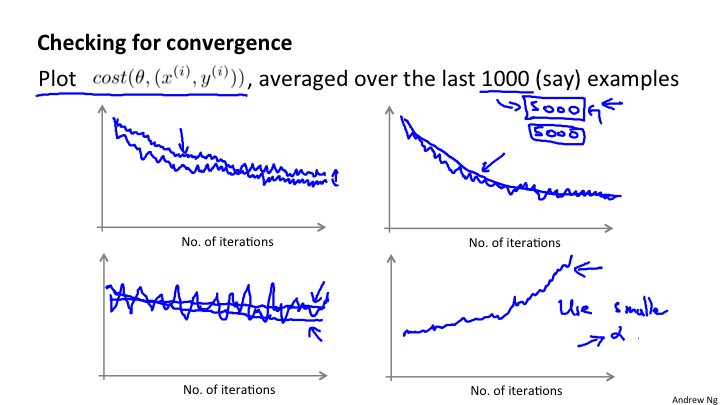

# Lesson17 大规模机器学习

## 17-1 大数据集学习
大量的数据产生的问题就是计算性能问题。在前面，我们知道对于高方差的（过拟合）的时候，使用更多的数据才更有效果；而对于高偏差，使用更多的数据集是没有意义的。所以在进行模型的训练的时候，先选取小量数据集，看看模型算法是处于高方差还是高偏差，进而决定是否增加数据的量。例如: m=100,000,000，先选取m=1,000来进行训练，做出训练模型图，知道是高方差还是高偏差，进而决定是否使用m=100,000,000来进行处理。因为小的数据集会让你的算法很快的运行。

## 17-2 随机梯度下降

提出的目的是因为，当我们进行正常的梯度下降的时候，我们每次使用的是所有数据，如果数据量很大，那么就需要批次的将数据导入到内存，执行梯度下降，而这样的效率就很低。

而随机梯度下降算法，是逐个样本进行梯度下降，最后，直到部分的样本就能够完成这个过程，也不需要批量的导入。

所以算法如下:

	Repeat {
		for i=1 to m {
			θ_j := θj - α(h_θ(x^(i) ) - y^(i) )(x_j)^(i)
		}
	}
	
所以数据要随机化。这里要特别注意 "Repeat"这一层，这里通常取1-10或者更多，因为这一层会使得结果逐渐收敛。

我觉得更好的随机化先进行聚类分析，然后再进行随机化，会使得数据更加随机.

实际上就是将梯度下降算法中的m=1来进行计算的。

这里对于真个算法纯数学证明，目前没有，只是一种解释。

## 17-3 最小批量梯度下降

最小批量梯度下降是使用一个比较小的样本来进行梯度下降。随机梯度下降中m=1,而标准的是m，那么小批量就是 b∈[2, 100] 使用这样一个小的样本数据集进行每次的梯度下降。

为什么小批量的梯度下降会更快一点的呢？是因为通过向量化，可以进行适当的并行计算，从而加速数据的计算。

## 17-4 随机梯度下降的收敛

这其实在前面已经阐述过，就是通过图像进行观察是否收敛。只是现在是通过每1000次迭代，来计算cost(θ, (x^\(i), y^\(i)) 的算术平均，来观察是否向下收敛。观察是否收敛是非常重要的步骤和环节。

另外关于学习速率α来说，是可以通过随着时间的变化来使得α变小来得到更加精准的拟合。

绘制代价函数的曲线，有助于我们分析和判断.当我们对不同的批量数据，例如1000或5000进行曲线的绘制，会得到不同的平滑曲线。但最终都是要向下收敛的。如果曲线过于平着震荡，那么很有可能是因为选择绘制曲线的样本数量过少导致的，尝试使用更大的熟练进行绘制。也可能是α值过大。

关于α的变化问题，可以尝试变化，使用这个算法:

	α = const1 / (迭代次数 + const2)
	
这样就会随着迭代次数的增加而逐渐减小。但是一些人不愿意使用这样的方法，因为需要调整const1和const2也就意味着需要调整更多的参数。

## 17-5 在线学习
在线学习系统，最大的有点在于不需要存储数据，随着每天的新的数据自动学习。这本质上就是随机梯度下降算法，每次来一个数据，就学习一次，来一个数据就学习一次。这不需要保存之前的数据，而是随着网站的运行自动的不断优化自身。这个算法很牛呀！！！

点击率: (click-through rate)

一个在线学习的系统将是非常厉害。能够根据每一个数据的输入自动训练θ。当θ训练之后，可以使用θ对任意一个数据和现有商品之间的关系进行预测。使用逻辑回归预测的就是概率p，那么，就可以根据p的大小来进行商品的推荐。 

## 17-6 Map-reduce和数据并行

Map-reduce 能够处理非常大的数据。可以，通过分布式开源系统，例如Hadoop，来进行Map-reduce的实现。也可以，针对单一计算机的多核进行map reduce.其实,map reduce并非是关键的，关键的是 对算法的分解。

