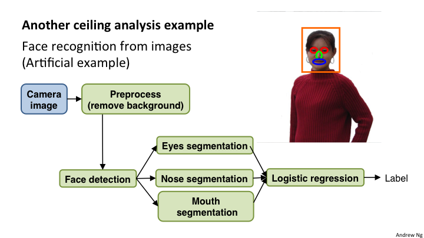

# Lesson18 应用举例: 图片 OCR
## 18-1 问题描述和流水线

1. 文字检测。将文字的区域检测出来
2. 字母分段。将是字母的区域分割出来。
3. 字母识别。对每一个字母进行识别。

作为机器学习系统设计，就是分解成流水线，然后安排不同的人去工作。我想TensorFlow可能使用的就是这样的方式建立起来的机器学习系统。

管道系统，是设计复杂机器学习的核心:

## 18-2 滑动窗口
所谓的滑动窗口，是对这样一个窗口所表达的区域进行训练，结果这个矩形区域能够正确识别处在窗口内部的事物。然后，再移动这个窗口，来不停的与图片中的区域进行比对，进行分类预测。所以步骤如下:

	1 训练窗口区域
	2 使用较小窗口区域进行循环移动，覆盖整个图片
	3 增大窗口区域，但要保证依然是82*36， 所以需要缩小图片。重复执行第二步

在上面的算法中，注意一点：增大识别窗口事实上是缩小图片来处理的。因为在进行训练的时候，使用的就是82\*36这个数据进行识别的.在人像识别中，因为人的比例是基本固定的，所以选择82*36这样的图像，进行分类学习。

文字检测与人像检测类似。

	1 训练窗口
	2 识别完文字，使用白色和灰色标记。
	3 膨胀识别块
	4 丢弃明显比率错误的块
	5 获得文字检测的区域
	
文字拆分，问题是从哪个位置进行拆分？学习。

	1 找到在矩形框中间能够正确拆分的样例和反向样例
	2 训练窗口
	3 拆分字符

字符识别，使用其他方法进行识别，例如神经网络。

## 18-3 人工合成数据

通过人工合成的方法可以得到更多的数据。例如，字符识别，语音识别，可以通过变形改造等形成新的训练集数据。

在你准备进行人工合成数据的时候，必须问清楚自己你的机器学习是否是高偏差的。以及你要多少工作来得到10倍的数据。

## 18-4 上限分析
当我们建立了机器学习流水线的各个组成部分之后，我们需要分析在哪个部分应该花费最多的时间。事实上，这个问题就是在进行性能分析，找出性能的瓶颈。显然，这种上限分析是基于管道模型的，分析管道中每一个节点。

| Component | Accuracy | 性能增量 |
| --------- |----------| -------|
| Overall System | 72% | 0 |
| Text Detection | 89% | 17 |
| Character Segmentation | 90% | 1 |
| Character Recognition | 100% | 10 |

通过这样的分析，我们知道性能增量最大的地方是17，所以应该优化这部分组件。

那么这里的 "Accuracy" 是如何测量的呢？ Accuracy的含义是系统这时候的正确率，最初的72%是正常的系统准确率；89%是当我们将 "Text Detection" 使用完全准确的结果之后，进行的继续测试得到89%，那么我们就知道当 "Text Detection"是完全准确的时候，能够提升系统准确率17. 接下来，在Text Detection是完全正确的情况下，提升" Character Segmentation"，那么系统从89% 提升到90%，说明优化空间不大。最后一定是100%。 通过这种方式来知道究竟提升哪个部分来增强系统的准确性。

基于管道模型的上限分析.

