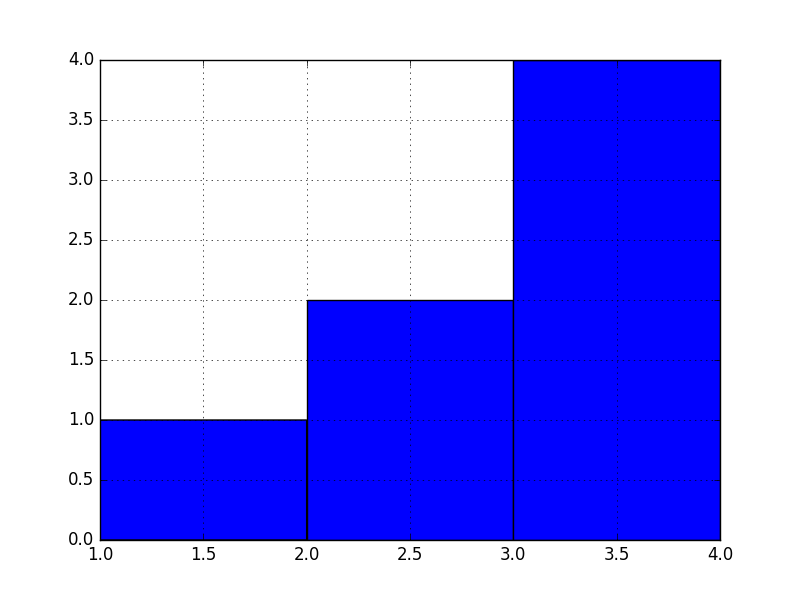

# Pandas实践

## 数据可视化
### 直方图绘制 hist
```
data = pd.Series([1, 2, 3, 4, 3, 2, 3])

data.hist(bins=3)

plt.show()
```



直方图图中 bins 参数表示有几个竖条，会将整个区域进行分隔，现在的最小值是1，最大值是4，所以横坐标从1开始到4，被分成了bins个竖条，所以就是[1,2）[2,3）[3,4] 纵坐标就是每个区间中的数量，例如[1,2）之间有 1个1，所以纵坐标是1；[3,4]有3个3+1个4=4个。既然知道直方图是这样来进行分隔和绘制的，那么可以用来看概率分布的。

另外，如果将1,2数值换成字母'a','b','c'是否可以呢？答案是不可以因为，'a''b''c'不是数值无法进行除以bins的分隔计算，所以不能是字母。

### 分类数据的可视化
