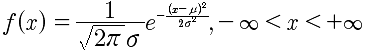
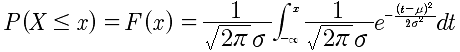
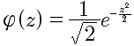

# 第十四讲 正态分布
正态分布的概率密度函数是:

其中，σ>0,μ∈R,记做 X~N(μ,σ**2).

正态分布的概率计算,


很遗憾上面的积分从数学的角度是算不出来的。计算的方法是使用计算机编程做近似计算。另外，常用的是通过标准正态分布来计算。

## 标准正态分布
若Z~N(0,1),称Z服从标准正态分布。Z的概率密度函数:


标准正太分布可以通过查表获取。

有如下性质:
```
当X~N(μ,σ**2)时，X-μ/σ ~ N(0,1)
```
标准正态分布使用
这里就是NG的课程中，特征量正规化的函数实现。通过上面的方法来做的normalize标准化。
所以在计算概率的时候转化成标准正态分布。

