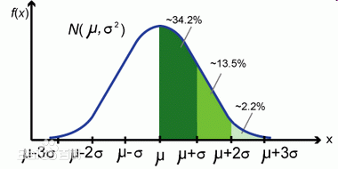
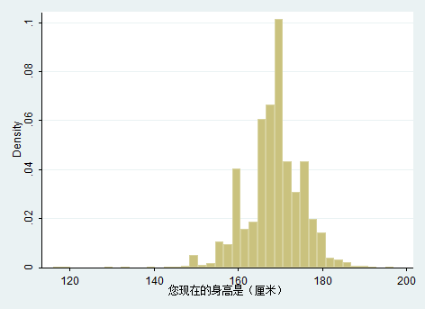

# 概率分布小结
在概率分布中，涉及到几个概念，随机变量x,概率密度f(x),分布函数F(x)以及概率P(X < x).对于计算来说，一般知道f(x)来计算P.所以就是f(x)->F(x)->P这样的一个计算步骤。

现在考虑，f(x)的实际意义是什么？是否存在实际意义？我们说x服从标准正态分布，那么，这个概率密度函数N究竟代码什么意义呢？



看这个图这条概率密度的曲线究竟是什么实际意义？让我们来看实际例子:

## 例子:身高分布
人的身高是服从正态分布的。那么，这样一个概率分布是如何得到的呢？统计10W人，将身高绘制成一张表，其中包括不同身高的人数。

| 身高 | 人数 |
|-----|------|
| 1.1 | 1000 |
| 1.65 | 50000 |
| 1.8 | 3000 |

那么，y轴表示数量，x轴表示身高绘制函数图像。那么，y=f(x)就是概率密度函数。如下图:



下图中y∈[0,1]，说明对y做了处理，这样影响的是σ参数。

这个理解要特别小心，特别小心的误区，就是通过离散的身高数据，计算出概率，能够拟合f(x)，成为一个连续的函数分布。但是，不能通过f(x)来反推x的人数或者概率。因为假设f(1）=500，那么f(1+delta)约等于500，当delta足够小的时候，这样总人数就是1000人了，会超过总人数的。所以不能通过f(x)来推导人数。原因就在于f(x)本身是连续的。所以下面的结论很关键:

```
在现实生活中，通过离散的x取值，也就是x1,x2,...,xn，并求得P(X=x1),P(X=x2)...P(X=xn)，使用P1,P2,...,Pn能够拟合出概率密度函数f(x).

如果使用f(x)反推P,那么仅仅有P(X=x1)=f(x1),P(X=x2),...P(X=xn)，将随机变量X看成离散的随机变量才成立，也仅仅是对这几个值成立，对其他的x是不成立的。

那么，如何认为x是连续型随机变量，通过f(x)如何求任意概率呢？通过F(x)=P(X<=x)=∫f(x)dx 来求解概率。当认为x是连续型随机变量的时候，P(X=x1)=0的，也就没有了意义。

所以现实中对连续型随机变量的研究是从离散入手，绘制概率密度f(x)曲线，再反求概率。而这种结论是不关乎随机变量符合那种随机分布，是可以作为一种统一的手段来进行处理的。
```

使用这种思想来思考逻辑回归:
```
对于一条样本记录X=(x1,x2,...,xn) Y=(0或1) 来说，事实就是将X向量变成一个数字，也就是XX = XΘ'，现在假设XX是符合高斯分布的，来求解Θ。在预测阶段就是，带入求出XX，即可知道究竟是哪个标签了。

现在假设Θ已经求出了，因为符合高斯分布，F(x)概率函数可知(F(x)=∫f(x)dx).现在是将数据分成两类0,1，那么就是对F(x)的值域进行了分类[0,0.5]是标签0，[0.5,1]是标签1.

现在剩下的问题就是如何训练Θ？同样使用F(x)进行拟合。也就是有F(xx)=∫f(x)dx. 那么，现在问题是F(xx)是不可积分的，于是寻找一个与F(xx)近似的函数来替代F(xx).那就是,逻辑回归中的函数:1/(1+e**(-x)). 这就是逻辑回归的原理和由来。

那么对于F(xx)=P(X<=xx)和分类之间的实际意义是什么呢？思考分类的本质，就是给定一个xx，确定这个xx的分类。那么，将xx所在的区间，按照分类去划分，例如逻辑回归，就是将xx的区间分割成了两部分，分别是(-∞,μ]和[μ，+∞)，所以，只要xx属于(-∞,μ）就认为是分类0，[μ,+∞)就是分类1.而当xx属于(-∞，μ],F(xx)<0.5，也就是P(X<=xx)<0.5.所以对于一个特征量来说xx=XΘ'的概率是不存在的，而是F(xx)=P(X<=xx)的计算,这里要注意不要混淆连续型随机变量的概率和离散型随机变量的区别。 另外一个地方需要理解的就是 对于样本中的一条记录X,y=1，表示的是,当F(XΘ')>=0.5时分类是1.
```

