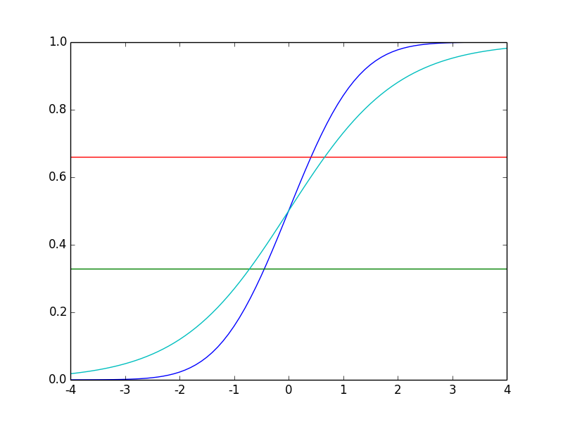

# 小结3
## 二元随机变量比对表
下面的对照表，理解了离散型概率和连续随机变量的对应关系。

| 二元离散型随机变量 | 二元连续型随机变量 |
| ----------------| ----------------|
| (X,Y)联合分布律: P(X=xi, Y=yj)=pij, i,j=1,2...| (X,Y)联合概率密度 f(x,y), (x,y)∈D|
| X的边际分布律 P(X=xi)=Σpij=pi* ,i=1,2,...| X的编辑概率密度fX(x)=∫f(x,y)dy |
|X=xi时Y的条件分布律 P(Y=yj \| X=xi) = pij / pi* | X=x时，Y的条件概率密度fY \|X(y \| x)=f(x,y)/f(x), y∈Dx |
| F(x,y)=P(X<=x, Y<=x)=Σpi...j 表示的是在x,y范围内所有的概率相加 | F(x,y)=∫∫f(x,y)dxdy,表示的是(x,y)在区域D的积分 | 

## 一元随机变量比对表
根据二元随机变量比对表，也给出一个一元随机变量比对表。

| 序号 | 比对名称 | 一元离散型随机变量  | 一元连续型随机变量 |
| --- | --- | -----------------|-----------------|
| 1 | 分布律 | P(X=xi)=pi,i=1,2.... | x概率密度 f(x)  |
| 2 | F(x) | F(x) = P(X<x)=Σp... | F(x)= P(X<=x) = ∫f(x)dx |

## 再次分析分类原理
分类过程包括:1 训练 2 预测。给定一个样本集，其中一条样本是x=(x1,x2,...,xn)，分类标签是y=0或1. 

原理:分类的就是假定xx = Θx',符合某种概率分布，然后，当新出现一个X_New的出现概率是多少进行分类。所以问题1：假定那种概率分布呢？答案是高斯分布。只有高斯分布才最能体现自然界的现象。也可以说，是当所有特征值以某种形态的均值是普遍符合高斯分布的。注意θX'是所有特征值的均值。在高斯分布的假定下，我们先看看预测过程。

### 预测过程
观察正态分布的图像，xx服从正态分布，也就是xx~N(μ，σ**2)


如果是分成两类，那么当XX出现在(-∞,μ]的区间的时候，认为分类是0；当XX出现在[μ,+∞)，认为分类是1.这很好理解，对于计算出来的一个xx，落在不同的位置取不同的分类。所以只要我们成功计算出Θ，那么，
```对于预测的xx_Predict = Θx_Predict',如果xx_Predict<=μ,分类为0；xx_Predict>=μ 分类为1.```

### 训练过程
训练的过程就是求解Θ的过程，使得XX=ΘX'符合正态分布。这里有两种做法，方法一 拟合概率密度函数; 方法二 拟合概率分布函数。

#### 拟合概率密度函数


对于一条样本X来说，当y=0的时候，f(xx)可以计算出来，可问题是从样本中无法得出f'(xx)是多少，也么也就无法进行拟合。也就是说y=0对于这个标签来说表达的意思究竟是什么?是概率密度的函数值吗？假设是概率密度的函数值，那么假设f(xx)的实际值是0.4，在y=0.4的情况下，因为是对称的，所以存在两个XX，所以无法使用这一点来进行拟合。那么我们只能走另外一条路，概率分布函数。

#### 拟合概率密度分布函数
现在看看y=0或者1代表究竟是否是概率函数。对于分类来说，就是将x的整个取值区间划分成分类个区域，现在因为是分成两个类别，所以是(-∞,μ] 和 [μ,+∞).对于任意一个样本y=0来说，有 xx <= μ, 那么,来寻求xx的关系。对于随机变量X来说，P(X<=xx) 有 P(X <= xx <=μ) 表示的就是分类y=0，所以 F(xx)=P(X<=xx)<P(X<=μ)=0.5 是与y=0对应的.也就是说F（xx)<0.5类别是0，那么，y=0，可以用作样本的F取值，进行拟合。也就是求 Σ(F(xx)-y)的最小值问题。

### 实际问题举例
身高问题，分类是 高和矮，那么 当x<μ的时候认为是矮；当x>μ的时候被认为是高。所以拟合x符合高斯分布即可。对于给定的身高x，拟合的是概率分布函数，原因是概率密度无法拟合。根据前面的比对表格，也明白概率就是概率密度函数。

### 对于多个分类问题
在NG的课程上解释的是0，1分类问题，那么对于0，1，2，更多分类问题如何处理呢？其实本质上是一样的，假设分成3个类别，那么就是将x的取值范围进行3等分。那么，如何3等分？直接将x的区间平均划分成3等分吗？显然不行。因为这个所谓的3等分是对样本数量的3等分，假设有3000条样本，合理的划分是每个分类中有1000条。现在因为是高斯分布所以会在靠近μ的附近x会集中的分布，要比两边的数量多。所以均分的概念，如果想象成离散型的是:x1的数量+...+xk的数量 = xk+1的数量 +... + xl的数量 = xl的数量+...+xn的数量。也就是说分成了三个区间[x1, xk],[xk,xl],[xl,xn]，要求有 count(x1)+...+count(xk)=count(xk+1)+....+count(xl) = count(xl) + .... + count(xn)。全部除以总数量S，就变成了额P(x1)+...+P(xk) = P(xk+1) + ... + P(xl) = P(xl) + ... + P(xn)也就是 P(x1<= X <xk) = P(xk <= X < xl) = P(xl < X <= xn) = 1/3. 对于连续型随机变量就是 F(xk) = F(xl) - F(xk) = F(xn) - F(xl),也就是 ∫f(x)dx| (-∞,xk) = ∫f(x)dx| (xl, xk) = ∫f(x)dx|(xk,﹢∞). 所以就是在F(x)=1/3, 2/3, 这两个位置绘制两条直线将F(x)进行了分割。这种方式，如果考察F(x)的图像曲线就更加容易看清楚。


对于不同的标签来说,y=0,就是让所有的F(x)为0进行逼近; y=1，F(x)=0.5进行拟合; y=2, F(x)=1进行拟合。这也就是逻辑回归的拟合方式。

## 分布表