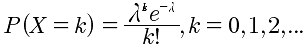

# 小结4-概率全息表
## 概率分布

对照表,各种分布，概率密度，分布函数，期望，以及相关的所有公式的全方位的总结。


| 序号 | 离散型随机变量分布 | 记号 |公式 |
| ----|-----------------|------|-----|
| 1 | 0-1分布 | -- | |
| 2 | 二项分布 | X~B(n,p) ||
| 3 | 泊松分布 | x~π(λ) ||
| 4 | 几何分布 | X~Geom(p)||

## 分布函数
离散型分布函数:

```
1 F(x)=P(X<=x)
2 P(a < X <=b) = P(X<=b) - P(X<=a) = F(b) - F(a)
3 P(a < X < b) = P(a< X <= b-0) = F(b) - F(a)
4 P(X=b) = P(X <= b) - P(X<b) = F(b) - F(b-0)
5 P(a< X < b) = P(a< X <= b) - P(X=b)
```

一般地，离散型随机变量的分布函数为阶梯函数，假设X的分布律为P(X=xk)=pk, k=1, 2,..., X的分布函数为 ,F(x)在x=xk(k=1,2,...)处有跳跃，跳跃值为pk=P(X=xk).

连续型随机变量X的分布函数F(x):，其中f(x)称为X的概率密度函数。

概率密度的性质:

1. f(x)>=0
2. 
3. 
4. F'(x)=f(x)

概率密度典型分布函数:

| 序号 | 连续型随机变量概率密度 | 记号 |公式 |
| ----|-----------------|------|-----|
| 1 | 均匀分布| X~U(a,b)||
| 2 | 指数分布 | X~E(λ) ||
| 3 | 正态分布 |X~N(μ,σ)||

Y=g(x)的概率密度求解定理:

设随机变量X~fX(x),-∞<x<+∞, Y=g(X)，g'(x)>0或者g'(x)<0，则Y具有概率密度为:


## 二元随机变量
离散型二元随机变量:

 

离散型二元随机变量边际分布率:
 

下面的表格很清楚的表达了二元随机变量的概率分布。
 

离散型二元随机变量条件分布律:


连续型二元随机变量:

联合分布函数:


将X<=x,Y<=y看成是(x,y)的区域，就是这个区域内的所有概率相加.

边际分布函数.


离散型条件分布函数:


连续型条件分布函数:


### 二元连续型随机变量


性质如下:

1. f(x,y) >= 0
2. 
3. 设D是xoy平面的区域，点(X,Y)落在D内的概率为:
4. 在f(x,y)的连续点(x,y)，有

边际分布函数:


边际概率密度:


条件概率密度:

对于固定的y(注意是固定的y，也就是y等于某个常数),fY(y)>0,并且fY(y)连续，则在Y=y的条件下,X的条件概率是:


### 二元均匀分布
二元随机变量(X,Y)的概率密度在一个游街的区域D内是常数，其他地方为0，则称(X,Y)在D上服从均匀分布。设f(x,y)= 1/A (x,y)∈D 或者 f(x,y)=0, 其他. 

### 二元正态分布
设二元随机变量(X,Y)的概率密度为:


边际概率密度:


条件概率密度:


## 二元随机变量的独立性
若P(X<=x, Y<=y)=P(X<=x)P(Y<=y)即F(x,y)=FX(x)FY(y)，则称X,Y相互独立。

离散型独立判断:
对一切i,j都有: P(X=xi,Y=yj)=P(X=xi)P(Y=yi)

连续型独立判断:
对于平面的点(x,y)，处处有f(x,y)=fX(x)fY(y)

二元正态随机变量(X,Y)，独立的充要条件是ρ=0.

多元随机变量独立定理:

设(X1,X2,...,Xm)与(Y1,Y2,...,Yn)相互独立,则有
1. Xi与Yj相互独立
2. h(x1,x2,..,xm)和g(y1,y2,...yn)是连续函数，则h与g相互独立。也就是说线性相关的也相互独立。

## 二元随机变量的函数分布


Z=X+Y的概率密度为:


正态分布的分布:


## 离散型随机变量的独立和分布


## M=max(X,Y) 和 N=min(X,Y)的分布


## 数学期望


| 分布名称 | 期望 |
| --------|-----|
| 泊松分布 X~π(λ) | E(X)=λ |
| 正态分布 X~N(μ,σ**2) | E(X) = μ |
| 指数分布 X~E(λ) | E(X) = 1/λ |
| 二项分布 X~B(n,p) | E(X) = np |
| 几何分布 X~G(p) | E(X) = 1/p |
| 均匀分布 X~U(a,b) | E(X) = (a+b)/2|

随机变量函数的期望:


## 数学期望的性质
1. 
2. X,Y相互独立，有 


## 方差


| 分布名称 | 期望 | 方差 |
| --------|-----| ----|
| 泊松分布 X~π(λ) | E(X)=λ | D(X)=λ |
| 正态分布 X~N(μ,σ**2) | E(X) = μ | D(X)=σ\**2|
| 指数分布 X~E(λ) | E(X) = 1/λ | D(X)=1/λ\**2|
| 二项分布 X~B(n,p) | E(X) = np | D(x)=np(1-p) |
| 几何分布 X~G(p) | E(X) = 1/p |
| 均匀分布 X~U(a,b) | E(X) = (a+b)/2| D(X)=(b-a)\**2/12|

性质:


正态分布的期望和方差:


随机变量标准化的过程:

特别注意：标准化的过程是将随机变量的量纲消除了。并且将均值变为0，方差变为1.

## 协方差

计算公式:
Cov(X,Y)=E(XY)-E(X)E(Y)

性质:

在计算方差的时候优先考虑性质，而不是公式。

相关系数:


性质:


ρ的理解很关键，表示两个随机变量的相关性。如果二者线性相关，那么使用1个随机变量就可以了，没有必要使用两个随机变量。这一点是否可以用来进行对机器学习中特征量的维度进行化简呢？
