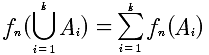

# 第一周
## 第1节 样本空间
所谓的样本空间就是所有事件构成的全集，理解这一点很关键，因为只有有了全集，才可以去考虑其他的概率问题。

## 第2节 事件的相互关系及运算
样本空间是个集合，某个事件也是个集合，所以事件的相互关系就是集合的关系。

A-B = A∩~B


AB=∅ 称作AB不相容或者互斥

### 习题
3 若A与B不相容，则对于任意事件C与D，AC与BD也不相容。
```
A∩B=∅, AC∩BD=CABD=CADB=CDAB=CD∅=C(D∅)=C∅=∅
```

4 A-B-C=A~B∩C
```
A-B-C=A∩~B-C=A∩~B∩~C
```

## 第3节 频率
频率的定义: f_n(A)=n_A/n
其中: n_A是A发生的次数,n是实验总次数

频率的性质:

1. 0<= f_n(A) <=1
2. f_n(S) = 1
3. 弱A1,A2, ..., Ak两两不相容,则 

## 第4节 概率
随着逐渐增多次数，频率会稳定在一个固定的值，这个值就称作概率。事件A的概率是 P(A).A的概率必须满足三条:

1. 非负性.P(A)>-0
2. 规范性:P(S)=1
3. 可列可加性。P(∪A)=ΣP(A)

满足这三条称P(A)为事件A的概率。

基本等式:
P(A-B)=P(A)-P(AB)


