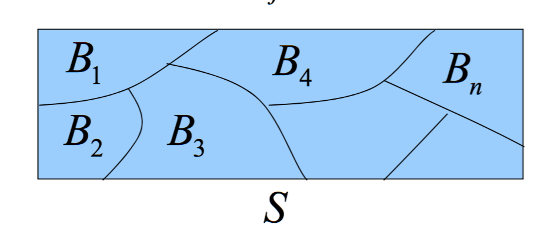
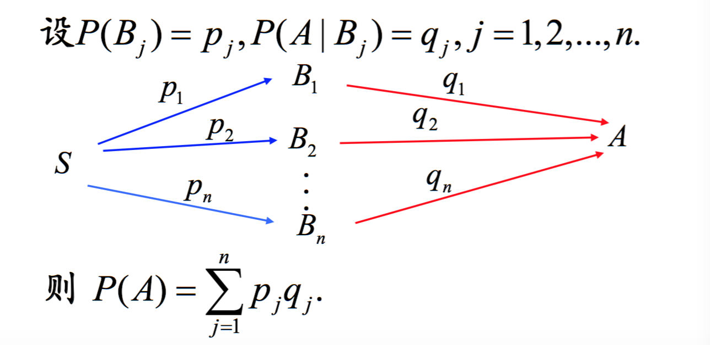

# Week2
## 第五讲 等可能概型
古典概率论，要求如下两点:

1. 样本空间S中的样本点，必须是有限的
2. 每个元素出现的概率，必须是等可能的

所以对于事件A来说，A中所包含的样本点除以S的样本点数，就是概率.

	P(A)= 中所包含的样本点 / S的样本点数

问题: 如果有N个球，其中a个白球，b=N-a个黄球，采用不放回抽样取n个球(n ≤N)，记Ak={恰好取到k个白球}（k≤a)，求P(Ak)?
```
1 计算S. 取出n个球，那么S的样本点数是 C(N,n)
2 计算Ak包含的样本点数。Ak的含义是n个球，其中k个白球，n-k个黄球。那么:C(a,k)*C(b,n-k).
3 P(Ak) = C(a,k)*C(b,n-k)/C(N,n)
```

## 第六讲 条件概率
P(B|A)表示A发生的条件下B发生的概率。这里可以理解为，在A是一个全新的样本空间，只是A的概率不是1.由此可以看出对于任意概率，事实都是P(A|S)在全样本空间下的条件概率。条件概率公式:

	P(B|A) = P(AB)/P(A); 
	当A=S的时候，P(B|S)=P(BS)/P(S)=P(B)
	
注意区别P(B|A)和P(AB)的含义。P(AB)的描述是AB同时发生；而P(B|A)是A发生的情况下B的概率。通过公式知道 P(B|A) > P(AB). 都是AB的概率，但是样本空间不同。

条件概率满足概率的所有性质。


计算用到的推导式:

	P(AB) = P(A) * P(B|A)

__心得体会__:条件概率，是改变了样本空间，这一点理解才是条件概率的根本，不是文字的理解。所以针对取两次球的问题，A1,A2, P(A1)*P(A2|A1) 这种条件概率的表述，是因为取走了A1之后，样本空间改变了。

## 第七讲 全概率公式和贝叶斯

```
一袋中有a个白球,b个黄球,记a+b=n.设每次摸到各球的概率相等,每次从袋中摸一球, 不放回地摸n次.则第k次摸到白球的概率均为a/n.现在用另一种方法计算第2次取到白球的概率.

解:
设Ai表示第i次取到白球，i=1,2
P(A2)=P(A1A2 ∪ ~A1A2) = P(A1A2)+P(~A1A2)
P(A1A2) = P(A1)*P(A2|A1) = a/n * (a-1)/(n-1) = a(a-1)/n*(n-1)
P(~A1A2) = P(~A1) * P(A2|~A1) = b/n * a/(n-1) = ab/n*(n-1)
P(A2) = (a(a-1)+ab) / n*(n-1) = a(a+b-1)/n*(n-1)=a(n-1)/n*(n-1)=a/n

```

全概率定义：称B1,B2,...,Bn为S的一个划分，若

1. 不漏。即:B1∪B2∪...∪Bn = S
2. 不重。即:BiBj = ∅，i != j,任意两个不相容.



全概率公式:

	P(A) = ΣP(Bj)*P(A|Bj), 其中Bj是第j个划分，Bj满足不漏和不重两个重要性质.
	


这样理解全概率，S被划分了n个部分，用B来表示，每一个部分有自己的概率，用p来表示，A相对于每一个区域的概率是q. 所以P(A) = pq. 注意，P(A)的概率的样本空间是S.所以在使用全概率的时候，重要的就是B的划分。

已知区域B的概率p,求A的概率q，被称作先验概率。那么能否，知道A的概率q，求B的概率呢？这就是后验概率，也就是贝叶斯公式。

	P(Bi|A) = P(ABi)/P(A) = P(Bi)*P(A|Bi)/P(A) = pi*qi/Σpq
	
贝叶斯的语言描述是，A发生时，每个划分的概率。

在机器学习中的应用，是这样的。每一个划分，Bi其实就是一个分类，所以对于机器学习来说，就是通过给定的样本，对于不同特征的发生情况下，求Bi的过程。形式化描述，如下:

```
样本每条记录有n个特征值,分别记做 X={x1, x2,...,xn},其中每一个特征值，有ki种取值（例如x1有k1=3种取值，就是x1有3种取值）。那么，对于任意一种所有特征取值的排列组成的集合称作Aj（一共最多有k1*k2*...kn个A, j∈[1, k1*k2*...*kn]), B表示所有分类，一共包含B1,B2,...Bm个分类。

那么，Aj属于哪一个分类呢？

训练算法:
计算P(Bi|Aj)的概率，i从1到m, 取最大值, 就是Aj的分类。解释，P(Bi|A)的含义就是Aj出现时候，Bi出现的概率，那么，显然Bi最大值，就是Aj决定的分类。这里隐含了，Bi∩Bj=∅，B1∪B2...∪Bm = S.

预测算法:
给定一条记录，将该条记录中的所有特征值比对Aj中的那种组合，就是相应的分类。
```

具体举例来说。

样本有3个特征量,X={x1, x2, x3}, x1的取值有2种(w,t),x2有3种(0,1,2)，x3有2种(p,q), k1=2, k2=3,k3=2. A的集合就是所有组合,一共有:2*3*2=12个元素.
A={(w,0,p),(w,1,p),(w,0,q)....}. 假设一共有3个分类。B={B1,B2,B3}.

训练的样本数据如下:


| x1 | x2 | x3 | B |
|---- | ---- |-----| ----- |
| w | 0 | p | b|
| w | 1 | q | c |
| ... | ... | ... | ... |
|t | 1 | p | a |

算法伪代码:

```
训练算法:
1. 提取x1,x2,x3所有特征值的值
2. 将x1,x2,x3中分别取出一个元素，组成三元组，作为一个事件，事件的集合记做A
3. 计算A中，每一个元素的概率P(Aj)
	3.1 P(Aj)计算:找到所有Aj的行/总的样本数 
4. 取出B中的标签种类，记做集合B
5. 计算B中每一个标签种类的概率
	5.1 计算Bi的行数/总的样本数 
6. 计算所有的条件概率概率P(Aj|Bi), i取[1, size(Bi)],j取[1, size(Aj)]
7. 计算分类的条件概率 max(P(Bi|A1)), i取[1,size(Bi)],当i=I1时,max(P(Bi|Aj))=P(BI1|A1); I1就是A1的分类。同理，计算A2,...,Ak => I2, ..., Ik
8. I1, I2, ...,Ik 就是分类

预测算法:
1. 给定一个预测样本x,匹配在A中的位置，是xk, 那么分类就是Ixk.
```

__心得体会__:全概率，条件概率问题绘制区域分布图，是一种最好的解决方案。

## tips
P(A-AB) = P(A) - P(AB). P(A) = P(A~B ∪ AB) = P(A~B) + P(AB) - 0 =
P(A-AB) + P(AB)

# 第八讲 事件的独立性
P(AB) = P(A)P(B)称作A和B是相互独立的事件。

```
	(1) P(AB) = P(A)P(B)
	(2) P(AC) = P(A)P(C)
	(3) P(BC) = P(B)P(C)
	(4) P(ABC) = P(A)P(B)P(C)
	
其中: (1) (2) (3)成立，称作A B C两两独立；而 (1) (2) (3) (4)成立,都成立才称作相互独立。
```

考虑A B独立和A B相容。如果A B不相容，说明 A∩B=∅，显然 P(AB)=0, 而 P(A),P(B)>0,所以不成立。也就是说如果A B不相容，那么A B一定不独立。为什么会有这样的结论？ 这样理解，假设S=A∪B，并且 A∩B=∅,则当A发生的时候，B的概率就是~A.所以二者是绝对关联的，所以不可能是独立的事件。所以只有A∩B != ∅, 才能去讨论独立的问题。

在实际问题中，往往不是通过公式来计算是否独立的，而是根据实际情况的特点来确定是否独立的。然后使用概率的乘积来简化计算。所以对于现在来说，计算P(AB)优先考虑是否是独立的再计算. 这样的方式对并集的概率也提供了支撑。

```
P(A∪B) = P(A) + P(B) - P(AB) = P(A) + P(B) - P(A)P(B)
```