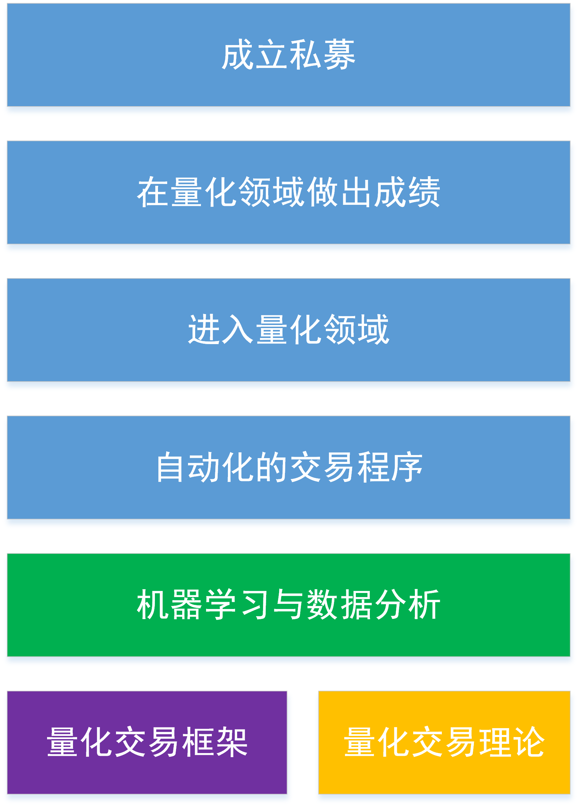

# 量化宣言

人生的梦想只有全力去追寻，哪怕是捧得头破血流。你能做的只有一件事，那就是最快速的前进。不要畏惧失败，因为成功就在失败之后。

# 量化交易计划
我的量化交易目标。

目前，我在进行的是机器学习和量化交易框架，但是，并没有引入量化交易理论。

## 机器学习
每日必须完成2课，这样才能在1个月之内完成。也就是春节假期结束，机器学习必须完成第一遍。然后，再用一个月的时间进入到第二轮编程实战阶段。

## scikit-learn学习
必须引入这个工具的学习，因为这个工具是进行量化分析的基础，有助于我们进行数据的分析与理解。NG的课程只是最基本的课程。
## 量化知识
1个月的时间完成 《统计套利》。每3天必须完成一章。这一章应该有详细的笔记。春节前完成这本书。然后开动下一本

## 零碎时间的学习与积累
概率论。1 每天的课程其实不多也就20分钟。这一部分通过早晨完成，去了先学习概率论。然后，对于课后习题，是通过将课件打印出来与习题打印出来。下班后，回家之后搞定。
scikit-learn.每天在工作中抽出时间就可以搞定一部分的学习。不看其他新闻，专心学习scikit-learn.
先把概率论和scikit-learn学完。在学完逻辑回归就要进入到优矿的练习了。先将自己的最简单的择时模型搞定。然后，在优矿上进行回测。
考察一下tushare的数据可靠性，如果能够拿到嘉幸的数据，那就最好了。
kaggle的学习，这一点必须进行。因为通过scikit-learn和概率论的学习，可以进行kaggle的训练。这样可以培养自己对数据的敏感性。
下一步，阅读最新的关于量化的paper.