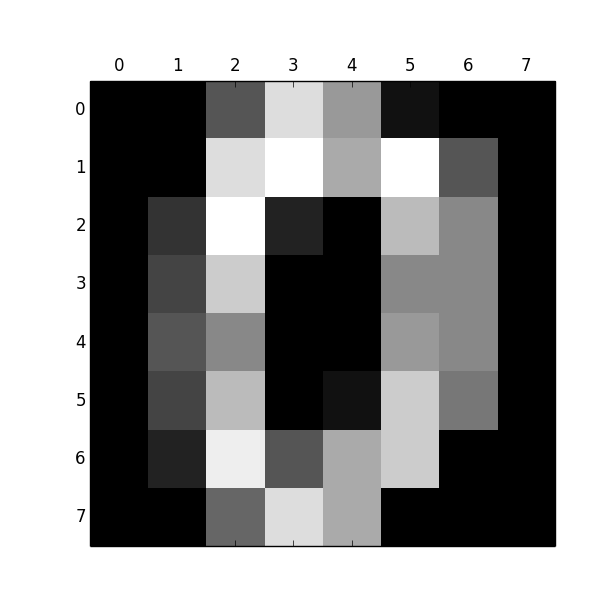

# 数据集
## 数字

每一个是8*8的矩阵，用灰度表示，0表示黑色，16表示白色，中间值表示不同的灰度。

```
from sklearn.datasets import load_digits
digits = load_digits()
print(digits.data.shape)

image = digits.images[0]
print type(image), digits.images[0].shape
print digits.images[0]

image[1][0] = 16
image[1][1] = 16
image[1][2] = 16


print type(image), image.shape
print image


import pylab as pl
pl.gray()
pl.matshow(image)
pl.show()


```



## 波士顿房价
```
/System/Library/Frameworks/Python.framework/Versions/2.7/bin/python2.7 /Users/panxu/Documents/MyProjects/MachineLearningBook/src/scikit_learn/scikit_learn_code/dataset/load_boston_demo.py
(506, 13)
Boston House Prices dataset

Notes
------
Data Set Characteristics:  

    :Number of Instances: 506 

    :Number of Attributes: 13 numeric/categorical predictive
    
    :Median Value (attribute 14) is usually the target

    :Attribute Information (in order):
        - CRIM     per capita crime rate by town
        - ZN       proportion of residential land zoned for lots over 25,000 sq.ft.
        - INDUS    proportion of non-retail business acres per town
        - CHAS     Charles River dummy variable (= 1 if tract bounds river; 0 otherwise)
        - NOX      nitric oxides concentration (parts per 10 million)
        - RM       average number of rooms per dwelling
        - AGE      proportion of owner-occupied units built prior to 1940
        - DIS      weighted distances to five Boston employment centres
        - RAD      index of accessibility to radial highways
        - TAX      full-value property-tax rate per $10,000
        - PTRATIO  pupil-teacher ratio by town
        - B        1000(Bk - 0.63)^2 where Bk is the proportion of blacks by town
        - LSTAT    % lower status of the population
        - MEDV     Median value of owner-occupied homes in $1000's

    :Missing Attribute Values: None

    :Creator: Harrison, D. and Rubinfeld, D.L.

This is a copy of UCI ML housing dataset.
http://archive.ics.uci.edu/ml/datasets/Housing


This dataset was taken from the StatLib library which is maintained at Carnegie Mellon University.

The Boston house-price data of Harrison, D. and Rubinfeld, D.L. 'Hedonic
prices and the demand for clean air', J. Environ. Economics & Management,
vol.5, 81-102, 1978.   Used in Belsley, Kuh & Welsch, 'Regression diagnostics
...', Wiley, 1980.   N.B. Various transformations are used in the table on
pages 244-261 of the latter.

The Boston house-price data has been used in many machine learning papers that address regression
problems.   
     
**References**

   - Belsley, Kuh & Welsch, 'Regression diagnostics: Identifying Influential Data and Sources of Collinearity', Wiley, 1980. 244-261.
   - Quinlan,R. (1993). Combining Instance-Based and Model-Based Learning. In Proceedings on the Tenth International Conference of Machine Learning, 236-243, University of Massachusetts, Amherst. Morgan Kaufmann.
   - many more! (see http://archive.ics.uci.edu/ml/datasets/Housing)


Process finished with exit code 0

```
## Irish-鸢尾花

iris:鸢尾花

```
鸢尾花数据集是非常容易的多分类的数据集

3个分类,每个分类50个样本,4个维度
该数据集包含了5个属性：
& Sepal.Length（花萼长度），单位是cm;
& Sepal.Width（花萼宽度），单位是cm;
& Petal.Length（花瓣长度），单位是cm;
& Petal.Width（花瓣宽度），单位是cm;
& 种类：Iris Setosa（山鸢尾）、
Iris Versicolour（杂色鸢尾），
以及Iris Virginica（维吉尼亚鸢尾）。

Bunch是字典的子类,事实上就是一个字典
```

代码

```
print type(data)
print data.keys()
print type(data['target_names'])
print data['target_names']
print type(data['data'])
print data['data'], data['data'].shape
print data['target']
print data['DESCR']
print data['feature_names']
print type(data['feature_names'])
```
输出

```
/System/Library/Frameworks/Python.framework/Versions/2.7/bin/python2.7 /Users/panxu/Documents/MyProjects/MachineLearningBook/src/scikit_learn/scikit_learn_code/dataset/load_iris_demo.py
<class 'sklearn.datasets.base.Bunch'>
['target_names', 'data', 'target', 'DESCR', 'feature_names']
<type 'numpy.ndarray'>
['setosa' 'versicolor' 'virginica']
<type 'numpy.ndarray'>
[[ 5.1  3.5  1.4  0.2]
 [ 4.9  3.   1.4  0.2]
 [ 4.7  3.2  1.3  0.2]
 [ 4.6  3.1  1.5  0.2]
 [ 5.   3.6  1.4  0.2]
 [ 5.4  3.9  1.7  0.4]
 [ 4.6  3.4  1.4  0.3]
 [ 5.   3.4  1.5  0.2]
 [ 4.4  2.9  1.4  0.2]
 [ 4.9  3.1  1.5  0.1]
 [ 5.4  3.7  1.5  0.2]
 [ 4.8  3.4  1.6  0.2]
 [ 4.8  3.   1.4  0.1]
 [ 4.3  3.   1.1  0.1]
 [ 5.8  4.   1.2  0.2]
 [ 5.7  4.4  1.5  0.4]
 [ 5.4  3.9  1.3  0.4]
 [ 5.1  3.5  1.4  0.3]
 [ 5.7  3.8  1.7  0.3]
 [ 5.1  3.8  1.5  0.3]
 [ 5.4  3.4  1.7  0.2]
 [ 5.1  3.7  1.5  0.4]
 [ 4.6  3.6  1.   0.2]
 [ 5.1  3.3  1.7  0.5]
 [ 4.8  3.4  1.9  0.2]
 [ 5.   3.   1.6  0.2]
 [ 5.   3.4  1.6  0.4]
 [ 5.2  3.5  1.5  0.2]
 [ 5.2  3.4  1.4  0.2]
 [ 4.7  3.2  1.6  0.2]
 [ 4.8  3.1  1.6  0.2]
 [ 5.4  3.4  1.5  0.4]
 [ 5.2  4.1  1.5  0.1]
 [ 5.5  4.2  1.4  0.2]
 [ 4.9  3.1  1.5  0.1]
 [ 5.   3.2  1.2  0.2]
 [ 5.5  3.5  1.3  0.2]
 [ 4.9  3.1  1.5  0.1]
 [ 4.4  3.   1.3  0.2]
 [ 5.1  3.4  1.5  0.2]
 [ 5.   3.5  1.3  0.3]
 [ 4.5  2.3  1.3  0.3]
 [ 4.4  3.2  1.3  0.2]
 [ 5.   3.5  1.6  0.6]
 [ 5.1  3.8  1.9  0.4]
 [ 4.8  3.   1.4  0.3]
 [ 5.1  3.8  1.6  0.2]
 [ 4.6  3.2  1.4  0.2]
 [ 5.3  3.7  1.5  0.2]
 [ 5.   3.3  1.4  0.2]
 [ 7.   3.2  4.7  1.4]
 [ 6.4  3.2  4.5  1.5]
 [ 6.9  3.1  4.9  1.5]
 [ 5.5  2.3  4.   1.3]
 [ 6.5  2.8  4.6  1.5]
 [ 5.7  2.8  4.5  1.3]
 [ 6.3  3.3  4.7  1.6]
 [ 4.9  2.4  3.3  1. ]
 [ 6.6  2.9  4.6  1.3]
 [ 5.2  2.7  3.9  1.4]
 [ 5.   2.   3.5  1. ]
 [ 5.9  3.   4.2  1.5]
 [ 6.   2.2  4.   1. ]
 [ 6.1  2.9  4.7  1.4]
 [ 5.6  2.9  3.6  1.3]
 [ 6.7  3.1  4.4  1.4]
 [ 5.6  3.   4.5  1.5]
 [ 5.8  2.7  4.1  1. ]
 [ 6.2  2.2  4.5  1.5]
 [ 5.6  2.5  3.9  1.1]
 [ 5.9  3.2  4.8  1.8]
 [ 6.1  2.8  4.   1.3]
 [ 6.3  2.5  4.9  1.5]
 [ 6.1  2.8  4.7  1.2]
 [ 6.4  2.9  4.3  1.3]
 [ 6.6  3.   4.4  1.4]
 [ 6.8  2.8  4.8  1.4]
 [ 6.7  3.   5.   1.7]
 [ 6.   2.9  4.5  1.5]
 [ 5.7  2.6  3.5  1. ]
 [ 5.5  2.4  3.8  1.1]
 [ 5.5  2.4  3.7  1. ]
 [ 5.8  2.7  3.9  1.2]
 [ 6.   2.7  5.1  1.6]
 [ 5.4  3.   4.5  1.5]
 [ 6.   3.4  4.5  1.6]
 [ 6.7  3.1  4.7  1.5]
 [ 6.3  2.3  4.4  1.3]
 [ 5.6  3.   4.1  1.3]
 [ 5.5  2.5  4.   1.3]
 [ 5.5  2.6  4.4  1.2]
 [ 6.1  3.   4.6  1.4]
 [ 5.8  2.6  4.   1.2]
 [ 5.   2.3  3.3  1. ]
 [ 5.6  2.7  4.2  1.3]
 [ 5.7  3.   4.2  1.2]
 [ 5.7  2.9  4.2  1.3]
 [ 6.2  2.9  4.3  1.3]
 [ 5.1  2.5  3.   1.1]
 [ 5.7  2.8  4.1  1.3]
 [ 6.3  3.3  6.   2.5]
 [ 5.8  2.7  5.1  1.9]
 [ 7.1  3.   5.9  2.1]
 [ 6.3  2.9  5.6  1.8]
 [ 6.5  3.   5.8  2.2]
 [ 7.6  3.   6.6  2.1]
 [ 4.9  2.5  4.5  1.7]
 [ 7.3  2.9  6.3  1.8]
 [ 6.7  2.5  5.8  1.8]
 [ 7.2  3.6  6.1  2.5]
 [ 6.5  3.2  5.1  2. ]
 [ 6.4  2.7  5.3  1.9]
 [ 6.8  3.   5.5  2.1]
 [ 5.7  2.5  5.   2. ]
 [ 5.8  2.8  5.1  2.4]
 [ 6.4  3.2  5.3  2.3]
 [ 6.5  3.   5.5  1.8]
 [ 7.7  3.8  6.7  2.2]
 [ 7.7  2.6  6.9  2.3]
 [ 6.   2.2  5.   1.5]
 [ 6.9  3.2  5.7  2.3]
 [ 5.6  2.8  4.9  2. ]
 [ 7.7  2.8  6.7  2. ]
 [ 6.3  2.7  4.9  1.8]
 [ 6.7  3.3  5.7  2.1]
 [ 7.2  3.2  6.   1.8]
 [ 6.2  2.8  4.8  1.8]
 [ 6.1  3.   4.9  1.8]
 [ 6.4  2.8  5.6  2.1]
 [ 7.2  3.   5.8  1.6]
 [ 7.4  2.8  6.1  1.9]
 [ 7.9  3.8  6.4  2. ]
 [ 6.4  2.8  5.6  2.2]
 [ 6.3  2.8  5.1  1.5]
 [ 6.1  2.6  5.6  1.4]
 [ 7.7  3.   6.1  2.3]
 [ 6.3  3.4  5.6  2.4]
 [ 6.4  3.1  5.5  1.8]
 [ 6.   3.   4.8  1.8]
 [ 6.9  3.1  5.4  2.1]
 [ 6.7  3.1  5.6  2.4]
 [ 6.9  3.1  5.1  2.3]
 [ 5.8  2.7  5.1  1.9]
 [ 6.8  3.2  5.9  2.3]
 [ 6.7  3.3  5.7  2.5]
 [ 6.7  3.   5.2  2.3]
 [ 6.3  2.5  5.   1.9]
 [ 6.5  3.   5.2  2. ]
 [ 6.2  3.4  5.4  2.3]
 [ 5.9  3.   5.1  1.8]] (150, 4)
[0 0 0 0 0 0 0 0 0 0 0 0 0 0 0 0 0 0 0 0 0 0 0 0 0 0 0 0 0 0 0 0 0 0 0 0 0
 0 0 0 0 0 0 0 0 0 0 0 0 0 1 1 1 1 1 1 1 1 1 1 1 1 1 1 1 1 1 1 1 1 1 1 1 1
 1 1 1 1 1 1 1 1 1 1 1 1 1 1 1 1 1 1 1 1 1 1 1 1 1 1 2 2 2 2 2 2 2 2 2 2 2
 2 2 2 2 2 2 2 2 2 2 2 2 2 2 2 2 2 2 2 2 2 2 2 2 2 2 2 2 2 2 2 2 2 2 2 2 2
 2 2]
Iris Plants Database

Notes
-----
Data Set Characteristics:
    :Number of Instances: 150 (50 in each of three classes)
    :Number of Attributes: 4 numeric, predictive attributes and the class
    :Attribute Information:
        - sepal length in cm
        - sepal width in cm
        - petal length in cm
        - petal width in cm
        - class:
                - Iris-Setosa
                - Iris-Versicolour
                - Iris-Virginica
    :Summary Statistics:

    ============== ==== ==== ======= ===== ====================
                    Min  Max   Mean    SD   Class Correlation
    ============== ==== ==== ======= ===== ====================
    sepal length:   4.3  7.9   5.84   0.83    0.7826
    sepal width:    2.0  4.4   3.05   0.43   -0.4194
    petal length:   1.0  6.9   3.76   1.76    0.9490  (high!)
    petal width:    0.1  2.5   1.20  0.76     0.9565  (high!)
    ============== ==== ==== ======= ===== ====================

    :Missing Attribute Values: None
    :Class Distribution: 33.3% for each of 3 classes.
    :Creator: R.A. Fisher
    :Donor: Michael Marshall (MARSHALL%PLU@io.arc.nasa.gov)
    :Date: July, 1988

This is a copy of UCI ML iris datasets.
http://archive.ics.uci.edu/ml/datasets/Iris

The famous Iris database, first used by Sir R.A Fisher

This is perhaps the best known database to be found in the
pattern recognition literature.  Fisher's paper is a classic in the field and
is referenced frequently to this day.  (See Duda & Hart, for example.)  The
data set contains 3 classes of 50 instances each, where each class refers to a
type of iris plant.  One class is linearly separable from the other 2; the
latter are NOT linearly separable from each other.

References
----------
   - Fisher,R.A. "The use of multiple measurements in taxonomic problems"
     Annual Eugenics, 7, Part II, 179-188 (1936); also in "Contributions to
     Mathematical Statistics" (John Wiley, NY, 1950).
   - Duda,R.O., & Hart,P.E. (1973) Pattern Classification and Scene Analysis.
     (Q327.D83) John Wiley & Sons.  ISBN 0-471-22361-1.  See page 218.
   - Dasarathy, B.V. (1980) "Nosing Around the Neighborhood: A New System
     Structure and Classification Rule for Recognition in Partially Exposed
     Environments".  IEEE Transactions on Pattern Analysis and Machine
     Intelligence, Vol. PAMI-2, No. 1, 67-71.
   - Gates, G.W. (1972) "The Reduced Nearest Neighbor Rule".  IEEE Transactions
     on Information Theory, May 1972, 431-433.
   - See also: 1988 MLC Proceedings, 54-64.  Cheeseman et al"s AUTOCLASS II
     conceptual clustering system finds 3 classes in the data.
   - Many, many more ...

['sepal length (cm)', 'sepal width (cm)', 'petal length (cm)', 'petal width (cm)']
<type 'list'>

Process finished with exit code 0

```